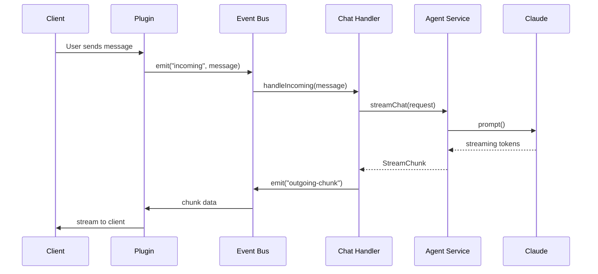

## Overview

Pinky follows a hub-and-spoke architecture where the **Gateway** acts as the central hub, managing connections to various clients and coordinating AI interactions.

## System Components

```
┌─────────────────────────────────────────────────────────────────┐
│                           Clients                                │
│  ┌─────────┐  ┌──────────┐  ┌─────┐  ┌──────────┐  ┌────────┐  │
│  │   Web   │  │ Telegram │  │ TUI │  │ Discord  │  │ Custom │  │
│  │  (React)│  │   Bot    │  │     │  │   Bot    │  │        │  │
│  └────┬────┘  └────┬─────┘  └──┬──┘  └────┬─────┘  └───┬────┘  │
└───────┼────────────┼───────────┼──────────┼────────────┼───────┘
        │            │           │          │            │
        │ WebSocket  │  Event    │ Socket   │  Event     │
        │            │  Bus      │ .IO      │  Bus       │
        └────────────┴─────┬─────┴──────────┴────────────┘
                           │
              ┌────────────▼────────────┐
              │         Gateway         │
              │                         │
              │  ┌───────────────────┐  │
              │  │     Event Bus     │  │
              │  │  (incoming/out)   │  │
              │  └─────────┬─────────┘  │
              │            │            │
              │  ┌─────────▼─────────┐  │
              │  │   Chat Handler    │  │
              │  │  (routes to LLM)  │  │
              │  └─────────┬─────────┘  │
              │            │            │
              │  ┌─────────▼─────────┐  │
              │  │   Agent Service   │  │
              │  │ (pi-coding-agent) │  │
              │  └─────────┬─────────┘  │
              │            │            │
              │  ┌─────────▼─────────┐  │
              │  │   Session Mgr     │  │
              │  │  (persistence)    │  │
              │  └───────────────────┘  │
              │                         │
              │  ┌───────────────────┐  │
              │  │   Task Scheduler  │  │
              │  │  (cron jobs)      │  │
              │  └───────────────────┘  │
              └────────────┬────────────┘
                           │
              ┌────────────▼────────────┐
              │    Storage (~/.pinky)   │
              │                         │
              │  instances/             │
              │    └── default/         │
              │        ├── sessions/    │
              │        ├── brain/       │
              │        └── tasks/       │
              │  plugins.json           │
              │  settings.json          │
              └─────────────────────────┘
```

## Core Components

### Gateway

The gateway is the heart of Pinky. It:

- Manages plugin lifecycle (start/stop)
- Routes messages through the event bus
- Handles authentication and instance isolation
- Provides tRPC API for management operations

- [Gateway Documentation](/gateway/overview) - 
  Learn more about the gateway


### Event Bus

A typed event emitter that decouples plugins from the chat handling logic:

| Event | Direction | Description |
|-------|-----------|-------------|
| `incoming` | Plugin → Handler | New message from a user |
| `outgoing` | Handler → Plugin | Complete response to send |
| `outgoing-chunk` | Handler → Plugin | Streaming chunk (for real-time updates) |
| `notification` | Scheduler → Plugin | Scheduled notifications |

### Agent Service

Built on `@mariozechner/pi-coding-agent`, the agent service:

- Creates and manages AI sessions
- Handles tool execution (read, write, bash, edit)
- Streams responses in real-time
- Tracks token usage for billing

### Plugins

Plugins are adapters that connect external services to Pinky:

- **WebSocket**: Real-time web client connections
- **Telegram**: Telegram bot integration
- **TUI**: Terminal user interface

- [Plugin System](/plugins/overview) - 
  Learn how to create custom plugins


### Brain

The brain stores persistent knowledge and skills:

- **Skills**: Markdown files that guide Pinky's behavior
- **Memory**: Facts and preferences Pinky remembers
- **Templates**: Reusable prompt templates

- [Brain System](/brain/overview) - 
  Learn about the brain


## Data Flow

### Incoming Message



### Session Management

Each conversation is tracked in a session:

1. **External channels** (Telegram) get isolated session directories
2. **Web clients** can create new sessions or continue existing ones
3. Sessions are cached in memory for fast access
4. Inactive sessions are cleaned up after 30 minutes

## Configuration

### Environment Variables

| Variable | Default | Description |
|----------|---------|-------------|
| `GATEWAY_DATA_DIR` | `~/.pinky` | Base data directory |
| `GATEWAY_DEFAULT_INSTANCE` | `default` | Default instance ID |
| `GATEWAY_WS_PORT` | `4445` | WebSocket server port |
| `GATEWAY_TRPC_PORT` | `4446` | tRPC API port |
| `ANTHROPIC_API_KEY` | - | Required for Claude |

### File Structure

```
~/.pinky/
├── plugins.json          # Plugin configuration
├── settings.json         # User settings (timezone, etc.)
├── instances/
│   └── default/
│       ├── sessions/     # Conversation history (.jsonl)
│       ├── brain/
│       │   ├── skills/   # Custom skills
│       │   └── memory/   # Persistent memory
│       └── tasks/
│           ├── active/   # Scheduled tasks
│           └── archive/  # Completed tasks
└── models.json           # Custom model configurations
```
