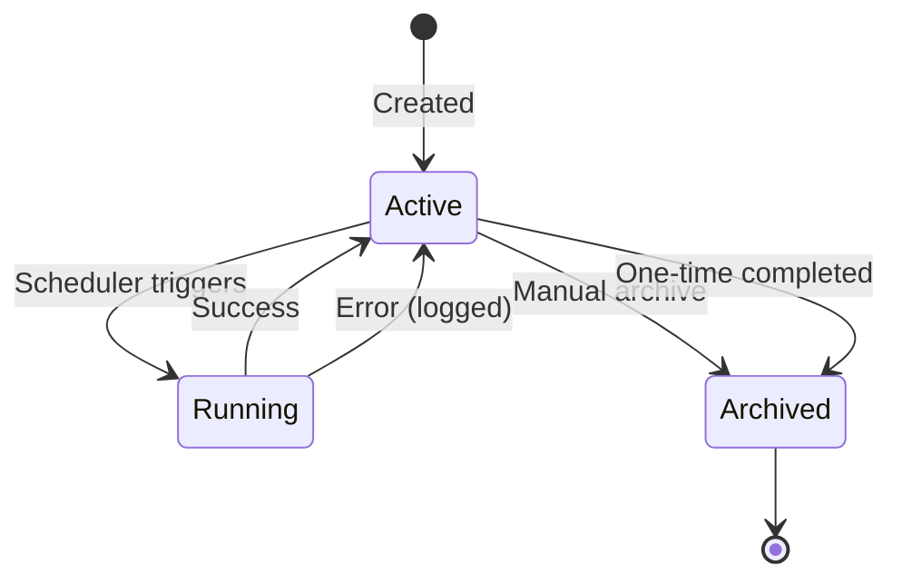

## Overview

Pinky can schedule tasks to run automatically. Tasks can be:

- **One-time**: Run once at a specific time
- **Recurring**: Run on a cron schedule

Tasks can either send notifications or execute LLM prompts.

## Task Structure

```typescript
interface Task {
  id: string;
  instance: string;
  name: string;
  description: string;
  schedule: TaskSchedule;
  execution: TaskExecution;
  notifications: TaskNotifications;
  metadata: TaskMetadata;
  sessionId?: string;    // Save LLM results to this session
  chatId?: string;       // Send results to this chat
}
```

## Schedule Types

### One-Time Schedule

```typescript
{
  type: "once",
  at: "2024-01-15T09:00:00Z"  // ISO 8601 timestamp
}
```

### Recurring Schedule

Uses cron syntax:

```typescript
{
  type: "recurring",
  cron: "0 9 * * *"  // Every day at 9 AM
}
```

**Cron Format:**
```
┌───────────── minute (0-59)
│ ┌───────────── hour (0-23)
│ │ ┌───────────── day of month (1-31)
│ │ │ ┌───────────── month (1-12)
│ │ │ │ ┌───────────── day of week (0-6, Sunday=0)
│ │ │ │ │
* * * * *
```

**Examples:**
| Cron | Description |
|------|-------------|
| `0 9 * * *` | Every day at 9:00 AM |
| `0 9 * * 1-5` | Weekdays at 9:00 AM |
| `*/15 * * * *` | Every 15 minutes |
| `0 0 1 * *` | First day of each month |

## Execution Types

### Notification

Simple message sent to configured channels:

```typescript
{
  type: "notification",
  message: "Don't forget to check your email!"
}
```

### LLM Prompt

Execute a prompt and send the response:

```typescript
{
  type: "llm",
  prompt: "What's on my calendar for today? Summarize the key meetings."
}
```

LLM tasks can:
- Access tools (read files, run commands)
- Save results to a session for context
- Send results back to a specific chat

## Creating Tasks

### Via Conversation

Pinky can create tasks through natural conversation:

```
You: Remind me to check my email every morning at 9 AM

Pinky: I've created a recurring task "Email Reminder" that will 
run every day at 9:00 AM and send you a reminder.
```

### Task File Format

Tasks are stored as YAML files in `~/.pinky/instances/{instance}/tasks/active/`:

```yaml
# email-reminder.yaml
id: email-reminder
instance: default
name: Email Reminder
description: Daily reminder to check email
schedule:
  type: recurring
  cron: "0 9 * * *"
execution:
  type: notification
  message: "Time to check your email!"
notifications:
  channels:
    - telegram
  priority: normal
metadata:
  createdAt: "2024-01-15T10:00:00Z"
  createdBy: user
  lastRun: null
  runCount: 0
  lastError: null
```

## Task Lifecycle



### Active Tasks

Located in `tasks/active/`. The scheduler polls this directory and:

1. Checks each task's schedule
2. Executes tasks whose time has come
3. Updates metadata (lastRun, runCount)
4. Archives one-time tasks after completion

### Archived Tasks

Completed or cancelled tasks move to `tasks/archive/`. These are kept for history but not executed.

## Notifications

Task results are sent to configured channels:

```typescript
interface TaskNotifications {
  channels: string[];        // ["telegram", "websocket"]
  priority: "normal" | "high";
}
```

### Channel Routing

Each plugin handles notifications for its channel:

```typescript
eventBus.on("notification", (notification) => {
  if (notification.pluginId !== "telegram") return;
  
  // Send to Telegram
  bot.api.sendMessage(chatId, notification.content);
});
```

## Scheduler Internals

The scheduler runs on an interval (default: 60 seconds):

```typescript
// Simplified scheduler loop
async function runScheduler() {
  const tasks = await loadActiveTasks();
  
  for (const task of tasks) {
    if (shouldRun(task)) {
      await executeTask(task);
      await updateTaskMetadata(task);
      
      if (task.schedule.type === "once") {
        await archiveTask(task);
      }
    }
  }
}
```

### Error Handling

Failed tasks don't stop the scheduler:

```typescript
try {
  await executeTask(task);
} catch (error) {
  task.metadata.lastError = {
    at: new Date().toISOString(),
    message: error.message
  };
  await saveTask(task);
  logger.error({ taskId: task.id, error }, "Task execution failed");
}
```

## Examples

### Daily Standup Prompt

```yaml
id: daily-standup
name: Daily Standup
schedule:
  type: recurring
  cron: "0 9 * * 1-5"
execution:
  type: llm
  prompt: |
    Good morning! Let's prepare for standup:
    1. Check my recent git commits
    2. Look at my open PRs
    3. Summarize what I worked on yesterday
notifications:
  channels: [telegram]
  priority: normal
```

### Weekly Report

```yaml
id: weekly-report
name: Weekly Summary
schedule:
  type: recurring
  cron: "0 17 * * 5"  # Friday 5 PM
execution:
  type: llm
  prompt: |
    Generate my weekly report:
    - Summarize commits from this week
    - List completed tasks
    - Note any blockers
notifications:
  channels: [telegram, websocket]
  priority: normal
```
